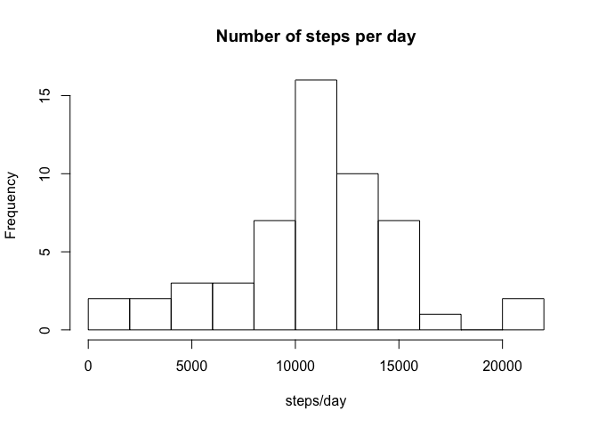
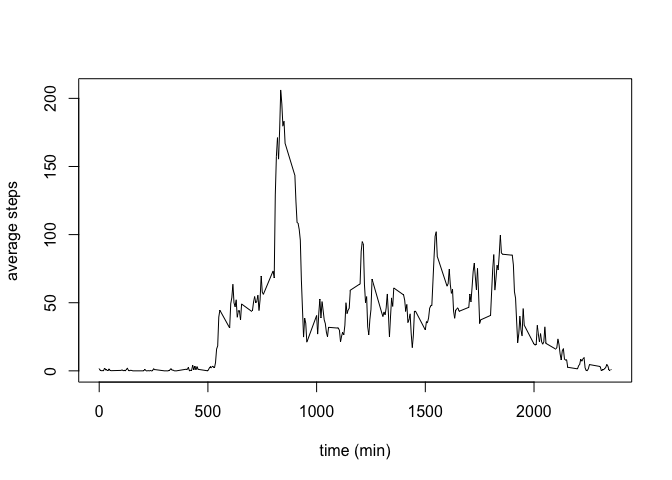
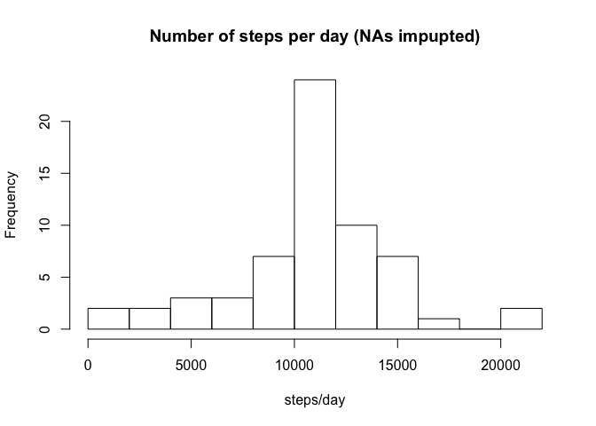
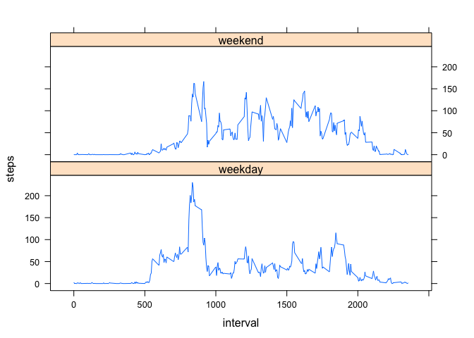

# Reproducible Research: Peer Assessment 1


## Loading and preprocessing the data
The data are included as a .zip file in the repository. The first thing to do is to un-zip it, using the ```unzip``` function:

```r
unzip(zipfile = "activity.zip")
```

Now we need to load the data into a data frame, using the ```read.csv``` function: 

```r
df <- read.csv("activity.csv", na.strings = "NA", header = TRUE, stringsAsFactors = TRUE)
```

For the data analysis carried on later it is convenient do convert the ```date``` variable to the actual R date type using ```as.Date```:

```r
df$date <- as.Date(df$date)
```


## What is mean total number of steps taken per day?
Let's compute the number of steps per day for each of the day in the dataset:

```r
steps_per_day <- with(df,tapply(steps,date,sum))
```

Let's produce an histogram of the number of steps per day:

```r
hist(steps_per_day, breaks = 10, main = "Number of steps per day", xlab = "steps/day")
```

<!-- -->

The mean of the number of steps per day:

```r
mean(steps_per_day,na.rm = TRUE)
```

```
## [1] 10766.19
```

And the median:

```r
median(steps_per_day,na.rm = TRUE)
```

```
## [1] 10765
```

## What is the average daily activity pattern?
In order to average across all days the value of steps taken in each 5-minute interval we use the function ```aggregate```:

```r
steps_vs_int <- aggregate(steps ~ interval, data = df, mean, na.rm = TRUE)
```

Let's plot the result using the option ```type = "l"```:

```r
plot(steps ~ interval, data = steps_vs_int, type = "l", xlab = "time (min)", ylab = "average steps")
```

<!-- -->

The 5-minute interval when the the maximum number of steps is taken is the number:

```r
iMax <- which.max(steps_vs_int$steps)
iMax
```

```
## [1] 104
```
which correspond to the minute 8:35.

## Imputing missing values
The number of missing values (NA) in the dataset is:

```r
nas <- sum(is.na(df$steps))
nas
```

```
## [1] 2304
```
which account for 13.1% of the total observations.

In order to impute the missing values it's useful to define the following function:

```r
impute.mean <- function(x) replace(x,is.na(x),mean(x,na.rm = TRUE))
```

It is convenient to use the ```dplyr``` package to manipulate the data frame.  
It can be installed using the ```install.packages()``` function.

```r
if(!require(dplyr)){
    install.packages("dplyr", dependencies = TRUE)
    library(dplyr)
}
```

A simple way to fill the missing values is to use the mean of the corresponding 5-minute interval. Let's create a data frame which is identical to ```df``` but with the ```NAs``` replaced using this metric.

```r
df_imp_meanInt <- df %>% group_by(interval) %>% mutate(steps = impute.mean(steps))
```

Let's compute, as before, the total number of steps taken each day, produce an histogram for all the days in the dataset and calculate the mean and median.

```r
steps_per_day_imp_meanInt <- with(df_imp_meanInt,tapply(steps,date,sum))
hist(steps_per_day_imp_meanInt, breaks = 10, main = "Number of steps per day (NAs impupted)", xlab = "steps/day")
```

<!-- -->

```r
mean(steps_per_day_imp_meanInt)
```

```
## [1] 10766.19
```

```r
median(steps_per_day_imp_meanInt)
```

```
## [1] 10766.19
```

As expected, the mean doesn't change, because the day with no measurements have been filled using, effectively, the mean itself: the mean of a variable is unchanged if further observation equal to the current mean are added.  
The median, which was already very close to the mean, now is identical (up to two decimal digits) to it: this result is expected as the sample is more and more peaked on the mean. 


## Are there differences in activity patterns between weekdays and weekends?
For the following it is convenient to define the following function:

```r
is.weekend <- function(x){
    out <- as.character()
    for (i in 1:length(x)){
        if (weekdays(x[[i]]) %in% c("Saturday","Sunday")) out[[i]] <- "weekend"
        else out[[i]] <- "weekday"
    }
    out
}
```

The function defined above is used to add the variable ```wday``` to the data frame.

```r
df_imp_meanInt$wday <- as.factor(is.weekend(df_imp_meanInt$date))
```

Now we use ```aggregate``` again to create a new data frame:

```r
steps_vs_int_wday <- aggregate(steps ~ interval + wday, data = df_imp_meanInt, FUN = mean)
```

Then we create a panel plot using the ```lattice``` package to inspect for differences in weekend and weekdays:

```r
require(lattice)
```

```
## Loading required package: lattice
```

```r
xyplot(steps~interval|factor(wday),data=steps_vs_int_wday,type="l",layout = c(1,2))
```

<!-- -->

As expected, the activity in the weekend is more spread out over the hours of the day and also seems to start later in the morning compared to weekdays.
